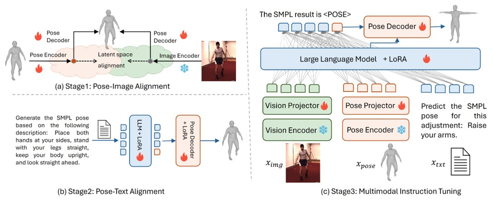

# PoseLLaVA: Pose Centric Multimodal LLM for Fine-Grained 3D Pose Manipulation

<div align=center>

[](https://ojs.aaai.org/index.php/AAAI/article/view/32302)
[](https://github.com/ustcfd/PoseLLaVA)
</div>

<div align="center">
  
</div>

PoseLLaVA is a multimodal framework for fine-grained human pose manipulation using natural language. Unlike previous works limited to coarse actions (e.g., "walking"), PoseLLaVA enables detailed pose control (e.g., "put both hands in front of the stomach") by integrating SMPL-based representations into the LLaVA architecture. It introduces a novel pose encoder-decoder for precise alignment across language, pose, and image modalities. PoseLLaVA supports three core tasks—pose estimation, generation, and adjustment—all guided by rich textual instructions. We also release PosePart, a new dataset with paired poses and fine-grained adjustment prompts, simulating human instructor-style guidance.

## Requirements and Installation

* Python >= 3.10
* Pytorch == 2.0.1
* CUDA Version >= 11.7
* Install required packages:
```bash
git clone https://github.com/PKU-YuanGroup/Video-LLaVA
cd Video-LLaVA
conda create -n videollava python=3.10 -y
conda activate videollava
pip install --upgrade pip  # enable PEP 660 support
pip install -e .
pip install -e ".[train]"
pip install flash-attn --no-build-isolation
pip install decord opencv-python git+https://github.com/facebookresearch/pytorchvideo.git@28fe037d212663c6a24f373b94cc5d478c8c1a1d
```

## Model Download
| **Model**     | **chekcpoint**                                            | 
|---------------|-----------------------------------------------------------|
| **PoseLLava** | [Huggingface](https://huggingface.co/FengD2023/Posellava) | 

## PosePart Dataset 
| **Model**                                    | **chekcpoint** |
|----------------------------------------------|----------------|
| **PosePart**                              | [GoogleDrive](https://drive.google.com/drive/folders/1K-k_3LaPaXlTjUWpOvlehAC6Yxqiv9RP?usp=drive_link) |

## Training
### Dataset Preparation
We will organize the multimodal datasets for each pose sub-task according to the example below and follow the format for each part of the training dataset. In this format, `<image>` and `<pose>` serve as placeholders for two different input modalities: the image and the SMPL parameters.

<details>
<summary>Example for Pose Generation task </summary>

```json
[
  {
    "id": "135000",
    "target_pose": ["Ground truth SMPL parameters.... "],
    "conversations": [
      {
        "from": "human",
        "value": "There is a person: torso is slightly leaning to the left, right arm is straight forward and hand is pointed down, left arm is down and bent up with the hand in front of chin Please output this person's SMPL pose."
      },
      {
        "from": "gpt",
        "value": "The SMPL pose of the person is <POSE>."
      }
    ]
  }
  ...
]
```
</details>

<details>
<summary>Inputing image example for Pose Estimation or Pose Adjustment task</summary>

```json
[
  {
    "id": "135000",
    "image": "S8_WalkDog_1.55011271_000026.jpg",
    "target_pose": ["Ground truth SMPL parameters.... "],
    "conversations": [
      {
        "from": "human",
        "value": "<image> + pose estimation/adjustment instruction"
      },
      {
        "from": "gpt",
        "value": "Sure, it is <POSE>."
      }
    ]
  }
  ...
]
```
</details>

<details>
<summary>Inputing SMPL Parameters example for Pose Adjustment task </summary>

```json
[
  {
    "id": "135000",
    "input_pose": ["Initialized SMPL parameters.... "],
    "target_pose": ["Ground truth SMPL parameters.... "],
    "conversations": [
      {
        "from": "human",
        "value": "<pose> Please peruse the description below. Extend your right arm to the right and back while keeping your right upper arm flat, with straight knees and feet shoulder-width apart. Start with the pose and use the textual description to generate the corresponding adjusted SMPL pose."
      },
      {
        "from": "gpt",
        "value": "The SMPL pose of the person is <POSE>."
      }
    ]
  }
  ...
]
```
</details>

### Training Dataset Configuration

We configure the training datasets for all tasks using a single JSON file `ds_config/train_ds.json`. The `root` specifies the directory of the image files, while SMPLpose is left empty. The `annotation` represents the path to the training files, and `repeat_time` and `length` can be used together to configure the ratio of training data for each part.

### Finetune with LoRA

Set the parameters in the script `shell/posellava_sft_lora.sh`, where `meta_path` is the path to the training dataset configuration file. To run the training script, use the following command: 

```bash
bash shell/posellava_sft_lora.sh
```

## Evaluation

Similar to the training setup, configure the evaluation datasets for each sub-task in the `ds_config/eval_ds.json` JSON file. In the evaluation script, set the path to the fine-tuned model weights. To run the evaluation script, use the following command: 

```bash
bash shell/run_inference.sh
```

## Demo

We provide a gradio-based web demo (demo video located at `papers/posellava_demo.mp4`). The demo loads the trained model and visually demonstrates its performance. Note that the web demo does not accept SMPL Parameters inputs, as inputing 72 SMPL parameters in the frontend is not practical; however, our VLLM does support this. You can test the SMPL input effect using the evaluation script. 
### Launch a model server
Configure the IP and port in config file（`gradio_demos/api/config.py`）and run the following command.
```bash
python gradio_demos/api/posechat_server.py
```

### Gradio Web UI
To run the web ui, use the following command:
```bash
bash shell/posellava_demo.sh
```

## Citation

If you find our work useful for your research, please consider citing the paper:

```bibtex
@inproceedings{feng2025posellava,
  title={PoseLLaVA: Pose Centric Multimodal LLM for Fine-Grained 3D Pose Manipulation},
  author={Feng, Dong and Guo, Ping and Peng, Encheng and Zhu, Mingmin and Yu, Wenhao and Wang, Peng},
  booktitle={Proceedings of the AAAI Conference on Artificial Intelligence},
  volume={39},
  number={3},
  pages={2951--2959},
  year={2025}
}
```
## Acknowledgments 
This project built with reference to the code of the following projects:[lmms-finetune](https://github.com/zjysteven/lmms-finetune), [PoseGPT](https://github.com/yfeng95/PoseGPT), [LLaVA](https://github.com/haotian-liu/LLaVA) and [InternVL](https://github.com/OpenGVLab/InternVL). We are grateful to them for releasing their models and code as open-source contributions.